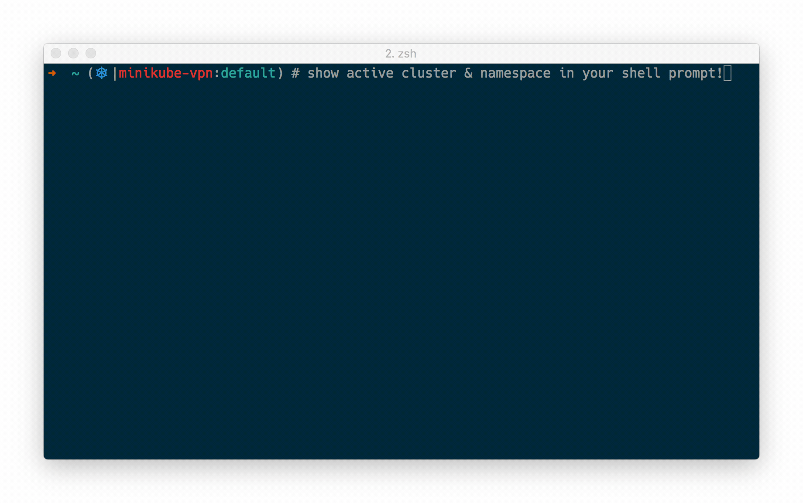

# Kubernetes 实用工具
为了方便开发和测试同事也能方便的连接到 k8s 查看资源，为此提供了一个 bash 脚本可以完成一些初始化配置和工具自动化安装

`bash` 脚本包含了简单的安装和配置

* [kubectl](https://kubernetes.io/docs/tasks/tools/install-kubectl/)
* kubectl alias
* [kubectl auto completion](https://kubernetes.io/docs/reference/kubectl/cheatsheet/#kubectl-autocomplete)
* [kubectl krew plugin manager](https://github.com/kubernetes-sigs/krew)
* [kube-prompt](https://github.com/c-bata/kube-prompt)
* kubeconfig **(只提供公司同事使用) (因为它你才有权限连接到 k8s 集群，可以把它当作是平时用的 ssh-key)**
* [kubectx & kubens](https://github.com/ahmetb/kubectx)
* [kube-ps1](https://github.com/jonmosco/kube-ps1)

---

## 安装
### **macOS / Linux**
#### **Bash or ZSH shells**

将 **[install.sh](install.sh)** 文件内容拷贝下来粘贴到本地直接运行 `source install.sh`  


### 问题
- 在脚本中有 **source** 命令，所以需要使用 `source install.sh` 运行脚本，而不是直接 `./install.sh`

- 如果运行中报权限不住，则运行 `chmod +x xxx.sh`

- 脚本运行后发现还无法使用别名，则运行 `source ~/.bashrc` or `source ~/.zshrc`

- 重新打开中终端后还是无法使用别名等，可能是你存在了 `.bash_profile` 文件，所以 `.bashrc` 被忽略了，那么只要运行，再重新打开终端即可
  
  ```bash
  cat>>~/.bash_profile<<EOF
  if [ -f ~/.bashrc ]; then
    source ~/.bashrc
  fi
  EOF
  ```

**(您可以使用相同的命令来更新安装)**

<!-- 由于一些网络问题，所以需要在公司使用该脚本，因为资源大多数都是直接从公司本地网络进行下载，且指定了工具的版本
- kubectl v1.17.9
- krew v0.4.0
- kube-prompt v1.0.10 -->

---

## 使用 
**(最佳实践看各组件的官网 !!!)**
- **aliases**  
该脚本设置了别名 `kube` 以便与 **kubectl** 进行更快的交互，别名 `kube` 打印可用别名列表  
例如使用 `kg pod` 就是 `kubectl get pod`

- **krew & some plugin**  
**kubectl** 的包管理器插件，可以利用它下载 `kubectx kubens kubetail` 等工具  
这里 [插件列表](https://krew.sigs.k8s.io/plugins/) 下的都是可用的


    - `k ctx` 切换 kubeconfig current-context **(可以当作是切换 k8s 集群)**   
    - `k ns` 切换 kubeconfig current-namespace **(可以当作是切换当前 k8s 集群的命名环境)**

- **kube-prompt**   
这是一个和 **kubernetes** 交互式的工具，配置好 **kubeconfig** 即可直接在终端使用命令 `kube-prompt` **or** `kp` 进入交互式控制面  
  

- **kube-ps1**  
其实就是一个 **bash** 脚本，该脚本会在终端上显示当前 **kubeconfig** 上下文和命名空间的配置
  
    ```
    kubeon     : turn on kube-ps1 status for this shell.  Takes precedence over
    kubeon -g  : turn on kube-ps1 status globally
    kubeoff    : turn off kube-ps1 status for this shell. Takes precedence over
    kubeoff -g : turn off kube-ps1 status globally
    ```

---

## 贡献
如果您感觉缺少任何东西（例如，对其他 shell 的支持或某些与 kubectl 相关的功能的支持），请随时创建 PR 

---

## Roadmap
* [kube-shell](https://github.com/cloudnativelabs/kube-shell)
* [fzf](https://github.com/junegunn/fzf)